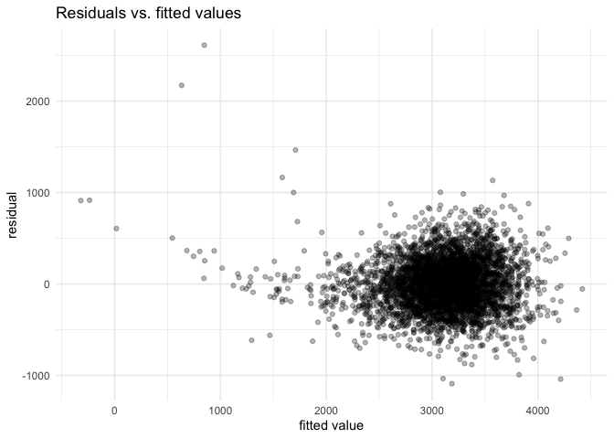
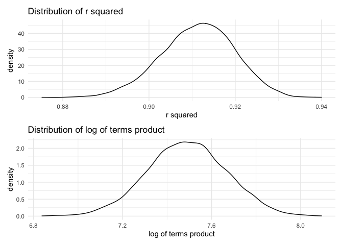

Homework 5
================
Yuanming Mao

## Problem 1

Read in the data.

``` r
homicide_df = 
  read.csv("data/homicide-data.csv", na = c("", "NA", "Unknown")) %>% 
  mutate(
    city_state = str_c(city, state, sep = ", "),
    victim_age = as.numeric(victim_age),
    resolution = case_when(
      disposition == "Closed without arrest" ~ 0,
      disposition == "Open/No arrest" ~ 0,
      disposition == "Closed by arrest" ~ 1
    )
  ) %>% 
  filter(
    victim_race %in% c("White", "Black"),
    city_state != "Tulsa, AL") %>% 
  select(city_state, resolution, victim_age, victim_race, victim_sex)
```

Start with one city

``` r
baltimore_df = 
  homicide_df %>% 
  filter(city_state == "Baltimore, MD")

glm(resolution ~ victim_age + victim_race + victim_sex, 
    data = baltimore_df,
    family = binomial()) %>% 
  broom::tidy() %>% 
  mutate(
    OR = exp(estimate),
    CI_lower = exp(estimate - 1.96 * std.error),
    CI_upper = exp(estimate + 1.96 * std.error)
  ) %>% 
  select(term, OR, starts_with("CI")) %>% 
  knitr::kable(digits = 3)
```

| term              |    OR | CI\_lower | CI\_upper |
| :---------------- | ----: | --------: | --------: |
| (Intercept)       | 1.363 |     0.975 |     1.907 |
| victim\_age       | 0.993 |     0.987 |     1.000 |
| victim\_raceWhite | 2.320 |     1.648 |     3.268 |
| victim\_sexMale   | 0.426 |     0.325 |     0.558 |

Try this across cities.

``` r
model_results_df = 
  homicide_df %>%
  mutate(
    victim_race = fct_relevel(victim_race, "White")
  ) %>% 
    nest(data = -city_state) %>% 
    mutate(
      models = map(.x = data, ~ glm(resolution ~ victim_age + victim_race + victim_sex, data = .x, family =   binomial())),
      results = map(models, broom::tidy)
    ) %>% 
    select(city_state, results) %>% 
    unnest(results) %>% 
    mutate(
    OR = exp(estimate),
    CI_lower = exp(estimate - 1.96 * std.error),
    CI_upper = exp(estimate + 1.96 * std.error)
  ) %>% 
  select(city_state, term, OR, starts_with("CI"))
```

``` r
model_results_df %>% 
  filter(term == "victim_raceBlack") %>% 
  mutate(city_state = fct_reorder(city_state, OR)) %>% 
  ggplot(aes(x = city_state, y = OR)) +
  geom_point() +
  geom_errorbar(aes(ymin = CI_lower, ymax = CI_upper)) +
  theme(axis.text.x = element_text(angle = 90, vjust = 0.5, hjust = 1))
```

<!-- -->

None of the 47 states show significantly higher odds of homicide among
Black victims than White victims. Black victims have significantly lower
odds of homicide than White victims in many states including Boston,
Omaha, Oakland, etc.

## Problem 2

``` r
birthweight_df = 
  read.csv("data/birthweight.csv", na = c("", "NA", "Unknown")) %>% 
  mutate(
    babysex = case_when(
      babysex == 1 ~ "Male",
      babysex == 2 ~ "Female"
    )
  ) %>% 
  select(bwt,bhead, babysex, blength, fincome, gaweeks, malform, smoken, wtgain)

typeof(birthweight_df$babysex)
```

    ## [1] "character"

The variables that I put into the regression model are the factors that
I think could affect the birthweight, including baby’s sex, baby’s head
circumference at birth, baby’s length at birth, family monthly income
(in hundreds, rounded), gestational age, average number of cigarettes
smoked per day during pregnancy, mother’s weight gain during pregnancy.

Plot of model residuals against fitted values

``` r
lm_1 = lm(bwt ~ babysex + bhead + blength + fincome + gaweeks + smoken + wtgain, data = birthweight_df)

birthweight_df %>% 
  add_predictions(lm_1) %>%
  add_residuals(lm_1) %>% 
  ggplot(aes(x = pred, y = resid)) +
  geom_point(alpha = .3)
```

<!-- -->

Compare the model with the other two using cross-validation

``` r
cv_df = 
  crossv_mc(birthweight_df, 100) %>% 
  mutate(
    train = map(train, as_tibble),
    test = map(test, as_tibble)
  )

cv_df = 
  cv_df %>% 
  mutate(
    mod_1 = map(.x = train, ~lm(bwt ~ babysex + bhead + blength + fincome + gaweeks + smoken + wtgain, data = .x)),
    mod_2 = map(.x = train, ~ lm(bwt ~ blength + gaweeks, data = .x)),
    mod_3 = map(.x = train, ~lm(bwt ~ bhead * blength * babysex, data = .x))
  ) %>% 
  mutate(
    rmse_mod_1 = map2_dbl(.x = mod_1, .y = test, ~rmse(model = .x, data = .y)),
    rmse_mod_2 = map2_dbl(.x = mod_2, .y = test, ~rmse(model = .x, data = .y)),
    rmse_mod_3 = map2_dbl(.x = mod_3, .y = test, ~rmse(model = .x, data = .y))
  )

cv_df %>% 
  select(starts_with("rmse")) %>% 
  pivot_longer(
    everything(),
    names_to = "model",
    values_to = "rmse",
    names_prefix = "rmse_"
  ) %>% 
  ggplot(aes(x = model, y = rmse)) +
  geom_violin()
```

<!-- -->

Compute rmse means for each model:

``` r
cv_df %>% 
  select(starts_with("rmse")) %>% 
  pivot_longer(
    everything(),
    names_to = "model",
    values_to = "rmse",
    names_prefix = "rmse_"
  ) %>% 
  group_by(model) %>% 
  summarize(avg_rmse = mean(rmse))
```

    ## `summarise()` ungrouping output (override with `.groups` argument)

    ## # A tibble: 3 x 2
    ##   model avg_rmse
    ##   <chr>    <dbl>
    ## 1 mod_1     281.
    ## 2 mod_2     334.
    ## 3 mod_3     289.

Conclusion: The model I built has the smallest rmse compared with the
other two and thus can predict birthweight better.

## Problem 3

``` r
weather_df = 
  rnoaa::meteo_pull_monitors(
    c("USW00094728"),
    var = c("PRCP", "TMIN", "TMAX"), 
    date_min = "2017-01-01",
    date_max = "2017-12-31") %>%
  mutate(
    name = recode(id, USW00094728 = "CentralPark_NY"),
    tmin = tmin / 10,
    tmax = tmax / 10) %>%
  select(name, id, everything())
```

    ## Registered S3 method overwritten by 'hoardr':
    ##   method           from
    ##   print.cache_info httr

    ## using cached file: /Users/yuanming/Library/Caches/R/noaa_ghcnd/USW00094728.dly

    ## date created (size, mb): 2020-10-09 14:02:19 (7.524)

    ## file min/max dates: 1869-01-01 / 2020-10-31

Use 5000 bootstrap samples and produce estimates of the two quantities
of interest for each bootstrap sample.

``` r
weather_boot_results = 
  weather_df %>% 
  drop_na(tmin, tmax) %>% 
  bootstrap(5000, id = "strap_number") %>% 
  mutate(
    models = map(.x = strap, ~lm(tmax ~ tmin, data = .x)), 
    results_est = map(models, broom::tidy),
    results_r2 = map(models, broom::glance)
  ) %>% 
  unnest(results_est) %>% 
  select(strap_number, term, estimate, results_r2) %>% 
  pivot_wider(
    names_from = term,
    values_from = estimate
  ) %>% 
  mutate(
    log.term.product = `(Intercept)` * tmin
  ) %>% 
  unnest(results_r2) %>% 
  select(strap_number, adj.r.squared, log.term.product) %>% 
  pivot_longer(
    adj.r.squared:log.term.product,
    names_to = "estimate",
    values_to = "value"
  )
```

Plot the distribution of the estimates

``` r
r_2_plot = 
  weather_boot_results %>% 
  filter(estimate == "adj.r.squared") %>% 
  ggplot(aes(x = value)) + 
  geom_density()

log_prod_plot = 
  weather_boot_results %>% 
  filter(estimate == "log.term.product") %>% 
  ggplot(aes(x = value)) + 
  geom_density()


r_2_plot / log_prod_plot
```

<!-- -->

For r

Using the 5000 bootstrap estimates, identify the 2.5% and 97.5%
quantiles to provide a 95% confidence interval for r̂<sup>2</sup> and
log (β̂ 1\*β̂2)

``` r
weather_boot_results %>% 
  group_by(estimate) %>% 
  summarize(
    CI_lower = quantile(value, 0.025),
    CI_upper = quantile(value, 0.975)
  ) %>% 
  knitr::kable(digits = 3)
```

    ## `summarise()` ungrouping output (override with `.groups` argument)

| estimate         | CI\_lower | CI\_upper |
| :--------------- | --------: | --------: |
| adj.r.squared    |     0.893 |     0.927 |
| log.term.product |     7.136 |     7.844 |
